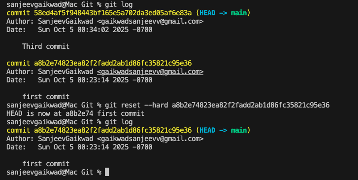

### GIT and GITHUB. 
- Git is version control system - manage the source code history.  
- Github Hosting and collaboration provider Git Repository Hosting.  
In GIT we have Repository - The location where your code history is stored.  
Branch - "Folder" within the repository containing commits.  
Commits- Different Stages of your code inside a branch.  

- git init //initialize git into particular location.  
- git add . //add all the files from the location to be tracked.  
- git Status - Shows status of location git presence on which file.  
- git commit -m "git message".  
- git branch. //shows master/ main. 
- Make changes in files.  
- Then git add .  
- git commit -m "Another Commit". 
- git log  //view all commits  
// if u want to delete any commit.  
git reset --hard a8b2e74823ea82f2fadd2ab1d86fc35821c95e36  
  
git show b2c3d4e5f6g7h8i9j0k1  
This will show:  
Which files changed  
What lines were added (+) or removed (-)  
The commit message and metadata  
You can limit the view to a specific file:  
- git show b2c3d4e5f6g7h8i9j0k1 -- src/App.java  
Or compare two commits:  
- git diff a1b2c3d4e5f6g7h8i9j0 b2c3d4e5f6g7h8i9j0k1 // Older commit followed by newer commit  
- @@ -1,4 +0,0 @@  
- This is a hunk header. It describes the line numbers affected:  
-1,4 → from the old file, lines 1 to 4 are being removed  
+0,0 → in the new file, nothing was added  
So: 4 lines removed, 0 added.  

If you just want to know which files changed in the 2nd commit:  
- git show --name-only b2c3d4e5f6g7h8i9j0k1  
Shorter logs with one line comments.

- git log --oneline  

